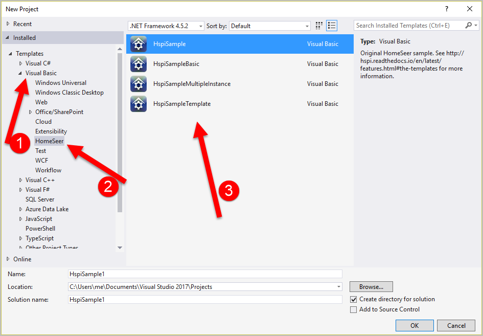

Features
========

.. _the-templates:

The templates
-------------

C#
^^

Until we have awesome names for the templates, you’ll have to use this key to determine which template is most appropriate for your project. 

* **HSPIPluginA**

    This template, based on the code at https://forums.homeseer.com/showthread.php?t=178122,  is as close as you can get to inheriting directly from HomeSeer’s ``IPluginAPI`` interface while still retaining the benefits of HSPI.

    The plugin created in this template inherits from ``Hspi.HspiBase``.  

    It’s a venerable sea of code – intimidating for new HomeSeer developers. 

* **HSPIPluginB**

    This template requires the smallest amount of code out of the box. It’s based on the code at https://forums.homeseer.com/showthread.php?t=184086. 

    The plugin created in this template inherits from ``Hspi.HspiBase2`` which inherits from ``Hspi.HspiBase``.  

    You get all of the benefits of HSPI, without having to implement everything in HomeSeer’s ``IPluginAPI`` interface. The base class implements suitable defaults for basic plugins, preventing you from having to understand everything in ``IPluginAPI``.  The flip side to such minimalistic code is that it’s not obvious which methods you *can* override. 

VB.NET
^^^^^^

Yes, the HSPI extension includes the original HomeSeer VB.NET project samples and templates in the extension. They're mostly changed from the download at https://forums.homeseer.com/showthread.php?t=160064, except the project uses the HomeSeerNuget package to make getting started a little easier. You'll find everything under ``Visual Basic > HomeSeer``.  

Code Quality
-------------

* All C# builds in HSPI are validated against a fairly strict set of static code analysis rules in an effort to automate code quality checks. 
* A Resharper "Code Cleanup" setting called "HSPI" helps to ensure all code follows the same standards.

Framework
---------
* ``HspiBase`` tries to eliminate many of HS's poor naming conventions from ``IPluginAPI``. It's quite a bit easier to understand. 